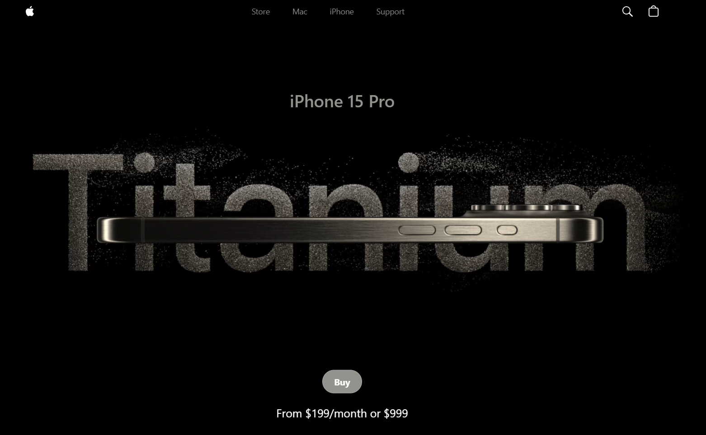

# Apple's iPhone 15


This is the clone of Apple's iPhone 15 website.
Check out the live demo [here](https://apple-iphone-15-sigma.vercel.app/).

---



---

---

## Tech Stack

- [React](https://reactjs.org/) + [Vite](https://vitejs.dev/)
- [Tailwind CSS](https://tailwindcss.com/)
- [GSAP](https://greensock.com/gsap/)
- [threeJS](https://threejs.org/)
- [Sentry](https://sentry.io/)

### Getting Started on local machine

Clone the repository:

```bash
git clone https://github.com/aditya-2k23/iPhone/
```

Install the dependencies:

```bash
npm install
```

Run the development server:

```bash
npm run dev
```

Open [http://localhost:3000](http://localhost:3000) with your browser to see the result.

### React + Vite

This template provides a minimal setup to get React working in Vite with HMR and some ESLint rules.

Currently, two official plugins are available:

- [@vitejs/plugin-react](https://github.com/vitejs/vite-plugin-react/blob/main/packages/plugin-react/README.md) uses [Babel](https://babeljs.io/) for Fast Refresh
- [@vitejs/plugin-react-swc](https://github.com/vitejs/vite-plugin-react-swc) uses [SWC](https://swc.rs/) for Fast Refresh
